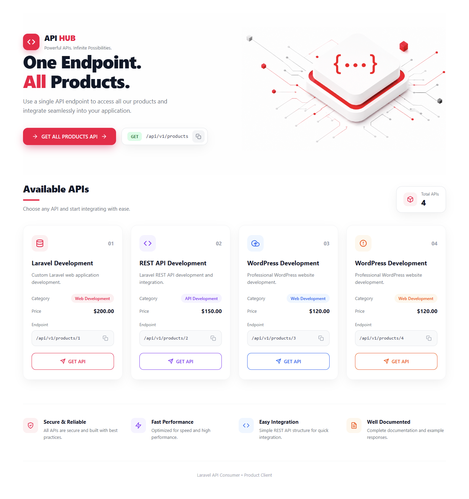

# Laravel Product API Client

A Laravel 13 client application that consumes a Laravel REST API and displays product data in a clean API dashboard.



## Projects

This project is the **client application** for a separate **Laravel Product API**.

The Product API provides product data through RESTful JSON endpoints, while this client consumes those endpoints and displays the returned product data.

## API Endpoints

### Get All Products

Returns all products from the Product API.

```text
GET http://127.0.0.1:8000/api/v1/products
```

Example:

```text
http://127.0.0.1:8000/api/v1/products
```

This endpoint returns a collection of products.

### Get Single Product

Returns one product using its ID.

```text
GET http://127.0.0.1:8000/api/v1/products/{id}
```

Example:

```text
http://127.0.0.1:8000/api/v1/products/2
```

This endpoint returns only the product with ID `2`.

## Features

- Enter any API endpoint from the frontend
- Fetch products from a Laravel REST API
- Fetch all products using the products collection endpoint
- Fetch a single product using its ID
- Supports both collection and single-product API responses
- Displays product ID
- Displays product description
- Displays product category
- Displays product price
- Displays product status
- Displays product count
- Displays API endpoint information
- Responsive API dashboard UI
- Horizontal product-card scrolling when more than four products are returned
- Laravel HTTP Client integration

## Tech Stack

- Laravel 13
- PHP 8.3
- Blade
- HTML5
- CSS3
- Laravel HTTP Client
- REST API
- MySQL

## Screenshot


## Local Setup

### 1. Clone the Repository

```bash
git clone https://github.com/MuddasirCreators/API-Generator-for-Product
```

### 2. Enter the Project

```bash
cd product-client
```

### 3. Install Dependencies

```bash
composer install
```

### 4. Generate Application Key

```bash
php artisan key:generate
```

### 5. Start the Product Client

```bash
php artisan serve --port=8001
```

Open the client:

```text
http://127.0.0.1:8001
```

## Product API Requirement

The separate **Product API** project must be running on port `8000`.

Start the Product API with:

```bash
php artisan serve --port=8000
```

The Product API will be available at:

```text
http://127.0.0.1:8000
```

## API Flow

### Get All Products

```text
User enters API URL
        ↓
Product Client
        ↓
Laravel HTTP Client
        ↓
GET /api/v1/products
        ↓
Product API
        ↓
JSON Response
        ↓
Products Blade View
        ↓
All Products Displayed
```

### Get Single Product

```text
User enters API URL
        ↓
Product Client
        ↓
Laravel HTTP Client
        ↓
GET /api/v1/products/{id}
        ↓
Product API
        ↓
JSON Response
        ↓
Products Blade View
        ↓
Single Product Displayed
```

## Example API URLs

### All Products

```text
http://127.0.0.1:8000/api/v1/products
```

### Product 1

```text
http://127.0.0.1:8000/api/v1/products/1
```

### Product 2

```text
http://127.0.0.1:8000/api/v1/products/2
```

### Product 3

```text
http://127.0.0.1:8000/api/v1/products/3
```

## API Response Types

### Multiple Products

The all-products endpoint returns:

```json
{
    "data": [
        {
            "id": 1,
            "name": "Laravel Development",
            "description": "Custom Laravel web application development.",
            "price": "200.00",
            "category": "Web Development",
            "is_active": 1
        },
        {
            "id": 2,
            "name": "REST API Development",
            "description": "Laravel REST API development and integration.",
            "price": "150.00",
            "category": "API Development",
            "is_active": 1
        }
    ]
}
```

### Single Product

The single-product endpoint returns:

```json
{
    "data": {
        "id": 2,
        "name": "REST API Development",
        "description": "Laravel REST API development and integration.",
        "price": "150.00",
        "category": "API Development",
        "is_active": 1
    }
}
```

The Product Client handles both response structures and displays the returned data accordingly.

## Project Architecture

```text
┌──────────────────────────────┐
│       Product Client         │
│       Laravel :8001          │
│                              │
│   User enters API URL        │
└──────────────┬───────────────┘
               │
               │ HTTP Request
               ↓
┌──────────────────────────────┐
│        Product API           │
│       Laravel :8000          │
│                              │
│ GET /api/v1/products         │
│ GET /api/v1/products/{id}    │
└──────────────┬───────────────┘
               │
               ↓
┌──────────────────────────────┐
│           MySQL              │
│                              │
│          products            │
│           table              │
└──────────────────────────────┘
```

## Related Project

**Product API** — Laravel REST API that provides product endpoints for retrieving all products and individual products by ID.

### Available API Routes

```text
GET /api/v1/products
GET /api/v1/products/{id}
```

## Author

**Muddasir**

Laravel / PHP Developer
